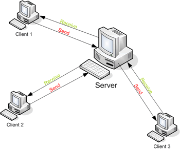
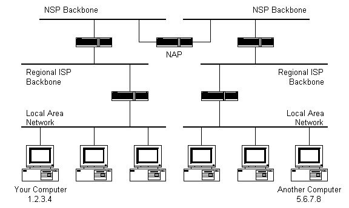
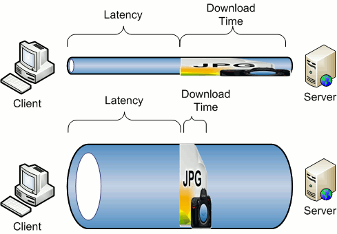

# How The Internet Works

## Objectives

``` 
- Be able to explain the difference between the Internet and the World Wide Web
- Be able to explain what a client and a server are
- Understand what a Internet Protocol (IP) address is
- Illustrate how data travels through the internet 
```

## Roadmap

### What exactly is the internet?

``` 
It is not a CLOUD!

Basically if you connect two devices, you have a network. Let's say that that network connected with another network, now you have a system of INTERconnected NETworks (INTER-NET).

The internet is simply a wire underground, and any two computers connected directly to this wire can communicate.
```

#### DIFFERENCE BETWEEN INTERNET AND WWW

``` 
The Internet is a global interconnection of computer networks; the World Wide Web is a way to navigate this massive network. In sailing terms, it's like comparing an ocean to a ship.

The internet allows for many different types of information to be processed, such as FTP (e.g., uploading files to your web host), processing email (e.g., SMTP) and viewing web pages (HTTP).
```


### History


``` 
1957 - Sputnik 1 was sent to orbit, causing the US to take action.

1958 - US founded DARPA (Defense Advanced Research Project Agency). Initial concept of packet networking led DARPA to development ARPANET, which is the first network to use Transmission Control Protocol (TCP).

1969 - Only 4 servers were live in the entire network. All of these were in the west-coast.
```


``` 
1972 - The first message was sent by Professor Leonard Kleinrock's laboratory at UCLA to Stanford

1973 - TCP started being replaced by IP (Internet Protocol) and by 1983 IP was being largely used
```


​​

``` 
1992 - Tim Berners-Lee invents the World Wide Web.

1993 - Mosaic, the first web-broweser, changes the way we interacted with the web.

1994 - The first online sale is made. A copy of Sting's album "Ten Summoner's Tales" was sold in early August by the Net Market Company, in Nashua, New Hampshire.
```


## Clients and Servers



### Servers

``` 
- Also known as "Host Computers"

- Servers are special computers whose primary function is to store, process and deliver web pages to clients. 

```

### Clients

``` 
- Your laptop, tablet and smartphone are all clients.

- When you view a web page your device has made a request to a server. The web page you see is the response from the server.
```

### Routers

Routers exist where two or more parts of the Internet intersect. They direct the packets around the Internet.



``` 
Modems - Your modems and home wireless routers are the first step on your short but long internet journey. They connect you directly to your ISP.

POPs - "Points of Presence" are local connection points owned by your ISP. They are usually windowless, climate-controlled buildings filled with computers.

NAPs - "Network Accesss Points" are similar to POPs except larger. They are usually located in cities.
```

------

### Class Activity

``` 
Explain to the person next to you the difference in client and server in your own words.
```

------

### Sending Information


``` 
- HTTP (Hypertext Transfer Protocol) is the protocol your browser uses to access the internet. Your computer, the client, makes requests and the server sends a response using HTTP. In the diagram above HTTP is represented in the "Application" layer.

- TCP/IP (Transmission Control Protocol/Internet Protocol) is the basic communication language or protocol of the Internet. 

- TCP manages assembling messages or files into smaller data packets that are transmitted over the Internet.

- IP handles routing packets to thier correct destination using IP addresses.
```


### IP Addresses


``` 
Everything connected directly or indirectly to the Internet has an IP address! (servers, computers, cellphones). Your public IP address is assigned by your ISP and is your unique identifier to the external internet. Your private IP address is assigned by your local network's router and is used.

- Google "what's my ip address" to determine your public IP address.

- Open "Network Utility" on your Mac. Under the "Info" tab there should be a dropdown menu under the heading "Select a network interface for information." Select "Wi-Fi" and your local IP address should be visible.
```

#### DNS (Domain Name System)


text goes here

``` 
- DNS is a application layer protocol (so is HTTP)

- The primary purpose of DNS is to translate domain names which can easily be memorized by human beings (e.g., http://generalassemb.ly) into an IP address that your internet-connected device can access
```

------

#### Class Activity

- In your Terminal use `nslookup` to determine a website’s public IP address


``` 
nslookup google.com
```

- Use `ping` to determine if a server will respond and how long the response takes


``` 
ping -c5 www.google.com

#the -c5 flag limits the number of ping attempts to 5, otherwise it would ping forever.
```

- Use trace route to show the number of routers your data must travel through to reach it’s destination


``` 
traceroute www.google.com
```

- Perform an HTTP request in your terminal. What information do you get back? Why is it just text? What is your browser doing with this information?


``` 
curl www.google.com
```

- View the public registration information for a given domain name:


``` 
whois generalassemb.ly
```


------

### EXTRA

##### Latency vs bandwidth

​

``` 
Because the Internet is a global network of computers each computer connected to the Internet must have a unique address. Internet addresses are in the form nnn.nnn.nnn.nnn where nnn must be a number from 0 - 255. This address is known as an IP address. 
```

``` 
- If you imagine the internet as a series of tubes, latency is the length of a tube between two computers and bandwidth is the width

- Latency: the longer the tube, the longer it takes for data to get from one point to another.

- Bandwidth: The wider the tube, the more data can be passed through it.
```

### LINKS/REFERENCES

- http://web.stanford.edu/class/msande91si/www-spr04/readings/week1/InternetWhitepaper.htm
  
- http://searchnetworking.techtarget.com/definition/TCP-IP
  
- http://www.howtogeek.com/148664/how-and-why-all-devices-in-your-home-share-one-ip-address/
  
- http://computer.howstuffworks.com/dns.htm
  
- https://zoompf.com/blog/2011/12/i-dont-care-how-big-yours-is
  
  ​
